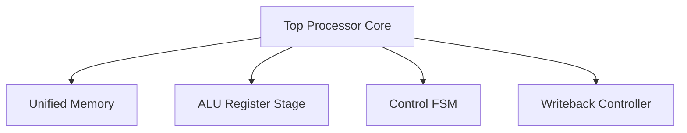

# RISC-V Processor Top Module & Synthesis Verification Suite

## Executive Summary
**RISC-V Processor Top Module & Synthesis Verification Suite** is a **FPGA Synthesis & Implementation** project implemented in SystemVerilog/Verilog and verified using AMD/Xilinx Vivado Simulator.

Complete RISC-V processor system pack verified for timing implementation and synthesis in AMD/Xilinx Vivado.

---

## Architectural Block Diagram

---

## Core Key Features & Highlights

- Post-implementation timing simulation model (`tb_top_processor_time_impl.v`).
- Unified Memory System (`Unified_mem.sv`, `unified_memory.mem`).
- Complete control & datapath register suite.

---

## Source Code & Module Index

| File Name | Module Name | Key Interface Signals |
| :--- | :--- | :--- |
| `immediate_gen.sv` | `immediate_gen` | `ins` (input), `output logic` (input) |
| `pc_reg.sv` | `pc_reg` | `next_pc` (input), `input logic clock` (input), `input logic reset` (input) |
| `reg.mem` | `reg.mem` | Internal Module / Support File |
| `unified_memory.mem` | `unified_memory.mem` | Internal Module / Support File |
| `Unified_mem.sv` | `Unified_Memory_1Port` | `clock` (input), `input logic memwrite` (input), `input logic` (input) |
| `ALU_reg.sv` | `single_result_reg` | `clock` (input), `input logic reset` (input), `input logic` (input) |
| `data_reg.sv` | `data_reg` | `data1` (input), `input logic` (input), `clock` (input) |
| `Instruction_reg.sv` | `Instruction_reg` | `old_pc` (input), `input logic` (input), `clock` (input) |
| `reg.sv` | `reg_file` | `rd` (input), `input logic` (input), `r1` (input) |
| `ALU.sv` | `ALU` | `ALU_control` (input), `input logic` (input), `data2` (input) |
| `alu_control.sv` | `alu_control` | `ALU_op` (input), `input logic` (input), `fun11` (input) |
| `alu_out.sv` | `ALU_output` | `Alu_result` (input), `input logic` (input), `ALU_output` (output) |
| `ALU_source1.sv` | `ALU_source1` | `data1` (input), `pc` (input), `old_pc` (input) |
| `ALU_Source_2.sv` | `ALU_source2` | `data2` (input), `immediate` (input), `input logic` (input) |
| `Mul.sv` | `multiplication_module` | `clock` (input), `input  logic                reset` (input), `input  logic` (input) |
| `mul_mux.sv` | `mul_mux` | `ALU_control` (input), `output logic` (input), `alu_1` (input) |
| `mux_mul.sv` | `Mul_output_mux` | `fun11` (input), `input logic` (input), `lo` (input) |
| `Control.sv` | `Control_unit` | `mult_ready` (input), `input logic` (input), `fun21` (input) |
| `adress_source.sv` | `adress_source_mux` | `pc_in` (input), `input logic` (input), `adress_source` (input) |
| `write_back.sv` | `write_back_mem_reg` | `data` (input), `input logic clock` (input), `input logic reset` (input) |
| `tb_top_processor_time_impl.v` | `RAM256X1S_UNIQ_BASE_` | `O` (output), `A` (input), `D` (input) |
| `Top.sv` | `top_processor` | `clock` (input), `input  logic reset` (input), `output logic` (input) |
| `tb.sv` | `tb_top_processor` | Internal Module / Support File |

---

## Hardware Simulation & Verification Guide

### Prerequisites
- **AMD / Xilinx Vivado Design Suite** (2020.1 or newer recommended)
- **ModelSim / Icarus Verilog / GTKWave** (Optional alternative simulators)

### Step-by-Step Execution in Vivado
1. **Open Vivado IDE** and launch a new project.
2. Select **RTL Project** without specifying sources initially.
3. Choose your target FPGA Device (e.g. `xc7a35tcpg236-1` Artix-7 or generic).
4. Click **Add Sources** -> **Add or Create Design Sources** and add all `.sv` / `.v` / `.mem` files from this repository.
5. Set the primary top-level module (e.g. `TOP.sv` / `top.sv`) as **Top Module**.
6. Navigate to **Flow Navigator** -> **Simulation** -> **Run Simulation** -> **Run Behavioral Simulation**.
7. Observe the waveform outputs in `xsim` to confirm state transitions and signal behavior.

---

## Author & Contact Details

Developed and maintained by **Mohammad Usman Irshad**.

* **GitHub Profile**: [@usman-irshad1](https://github.com/usman-irshad1)
* **Email**: [217554659+usman-irshad1@users.noreply.github.com](mailto:217554659+usman-irshad1@users.noreply.github.com)
* **Domain**: Digital Design, Verilog/SystemVerilog HDL, Computer Architecture & RISC-V Processor Cores.
